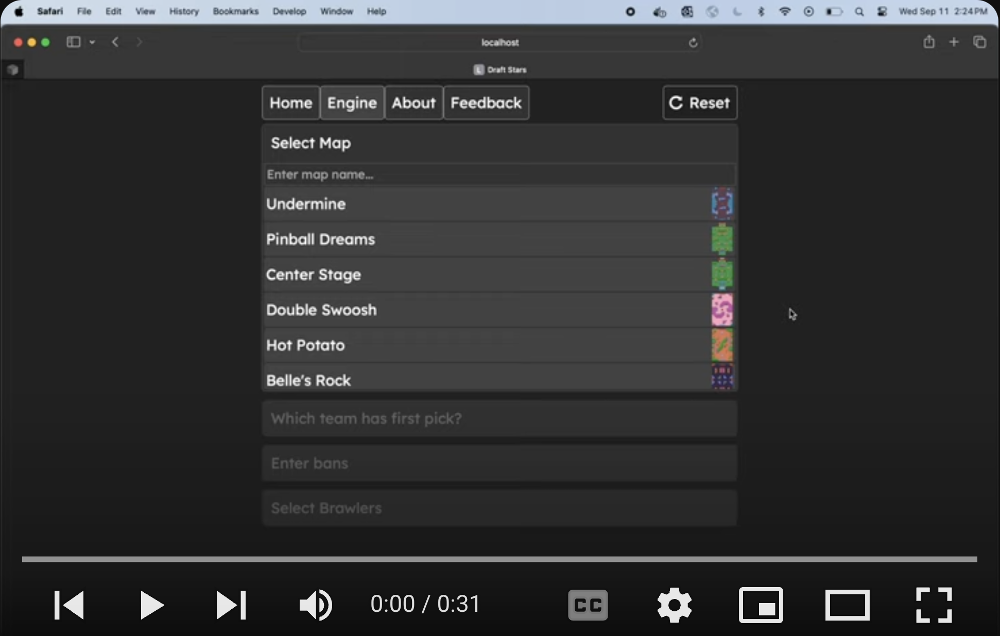

<div align="center">

  


  <h3 align="center">Draft Stars</h3>

  <p align="center">
    AI Draft Engine for Brawl Stars
    <br />
  </p>

  <a href="https://www.youtube.com/watch?v=gwCoYQUve7U&list=PL9lgGfhvEDZ16vKBjf5qXfNqH1yy9DhoH&index=1" target="_blank" rel="noopener noreferrer" >
    
  </a>
</div>

<h2>
  Description
</h2>
<p>
  Draft Stars is an AI-powered draft engine for Brawl Stars. Trained on over one million battles, it recommends character selections that optimize your chances of success based on unique in-game matchups.
</p>

<h2>
  Why?
</h2>

Selecting a brawler can be incredibly challenging. During the picking stage of a ranked match, you have only 20 seconds to choose from a roster of 83 characters. When making your choice, you must consider several difficult factors:
* Countering the enemy's picks
* Being difficult to counter by the enemy
* What your teammates have picked and will pick
* The map in play

<h1>
Technologies used
</h1>

* 🐳 <strong>Docker</strong>
* 🔒 <strong>Caddy</strong> for reverse proxy

<h3>
Backend
</h3>

* 🔥 <strong>PyTorch</strong> to create, train and load the model
* ⏩ <strong>FastAPI</strong> for the backend

<h3>
Frontend
</h3>

* :electron: <strong>React</strong>
* 🤖 <strong>reCAPTCHA</strong> for feedback submissions


<!-- GETTING STARTED -->
### Getting Started

## Setting up the backend:

1. First, you need three things, all of which can be downloaded here:

* <a href="https://drive.google.com/file/d/1eg7-MFAc94ubBJn0HoK23hCwguaRe9Um/view?usp=sharing">The Model<a>
* <a href="https://drive.google.com/file/d/1MYFUllcSzldQfGiil3yZkBzo4ppHMZt5/view?usp=sharing">The Brawler Embeddings</a> (download these as CSV)
* <a href="https://drive.google.com/file/d/182Fkae_QScmyzRhevi3L338Pmh1czOIt/view?usp=sharing">The Map Embeddings</a> (download these as CSV)

2. Create a folder in `backend/app` called `pytorch`. 
3. Add the three files you downloaded into `pytorch`.

The backend is now ready to run the model!

4. Create the container 
```
docker compose build backend
```
5. Run the container
```
docker compose up backend
```

4. (optional) If you want to set up SMTP email feedback, rename `backend/.env.example` to `.env`, and configure the environmental variables in there.

## Setting up the frontend:

1. Enter the frontend directory
```
$ cd frontend
```

2. Install dependencies
```
$ npm install
```
3. Create the container 
```
docker compose build frontend
```
4. Run the container
```
docker compose up frontend
```

# Downloading the assets

Unfortunately there isn't an easy way to download the brawler/map icon assets. The frontend is usable (but ugly) without them. If you want to download the assets, follow these steps.

<h2>Brawler Icons</h2>

1. Create a folder under `frontend/src/` named `brawlerIcons`
2. Go to https://fankit.supercell.com/d/YvtsWV4pUQVm/game-assets
3. Under 'Asset type' select 'Brawler Portraits'
4. Go to each brawler and download the image to `brawlerIcons`
* These should all be in png format. If not, go to `frontend/src/data/brawlers.js` and modify the imgUrl value of each brawler so the frontend knows what image to look for.

<h2>Map Icons</h2>

1. Create a folder under `frontend/src/` named `mapIcons`
2. Go to https://brawlify.com/maps/
3. On each map, right click and download the image to `brawlerIcons`
* These should all be in png/webp format. If not, go to `frontend/src/data/maps.js` and modify the imgUrl value of each brawler so the frontend knows what image to look for.